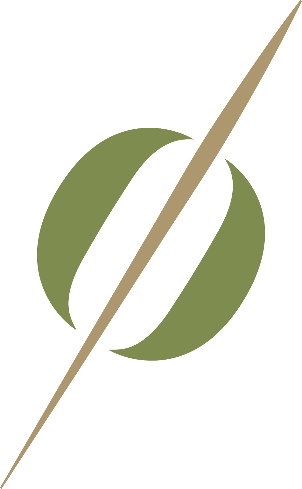

<h1> Welcome to the Cocktail Curations Website</h1>

  
  
  
  

> A Next.js web-application built for Cocktail Curations using Prismic.io as a headless-CMS.

## Built With

-   Next.js
-   React.js
-   SASS/SCSS
-   Framer Motion
-   Prismic.io

## Demo: [Live](https://cocktailcurations.vercel.app/)

 

## Author

### 👤 **Quan Cao**

-   Website: [www.qcao.dev](https://www.qcao.dev)
-   Github: [@qcaodigital](https://github.com/qcaodigital)
-   Twitter: [@qcao_dev](https://twitter.com/qcao_dev)

## Show Your Support

Feel free to clone this repo if you're interested in seeing how it works or give it a ⭐️ if you like it!
